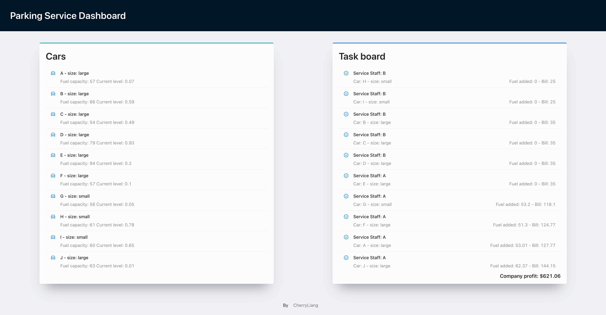

## Parking Service System

### Requirement

- Responsible: assign the workload equally between the two employees in a way that favours profit.

- Parking rate: Small cars - $25，large vehicles - $35
- Fuel rate: Every car with 10% or less fuel, will be refueled to maximum capacity - $1.75/litre
- Commission rate: Employee A - 11%, Employee B - 15%

### Have fun

#### Online

- Responsive layout has not been implemented yet
- [Click to check the demo](https://max-profit-assign-task.vercel.app/)

#### `yarn start`

- Optional: change the `cars.json` || `employees.json` before start
- Optional: uncomment the debug code to see the log
- Run `yarn start`

### Screen

